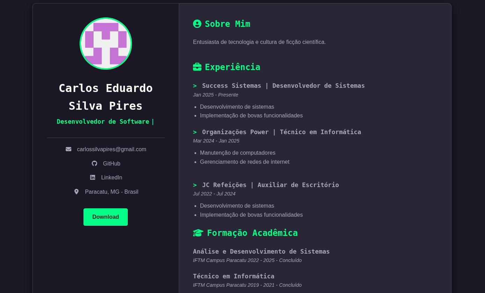

# Meu Currículo Online


<div align="center">
  
</div>

> Projeto de um currículo web pessoal, desenvolvido para apresentar minhas habilidades, experiências e projetos de uma forma moderna e interativa. Este repositório contém todo o código-fonte da aplicação.

### 🚀 Funcionalidades Principais

* **Design Responsivo:** Totalmente adaptável para visualização em desktops, tablets e celulares.
* **Animações Dinâmicas:** Efeito de digitação no cargo e animações de fade-in nas seções ao rolar a página.
* **Foto de Perfil Dinâmica:** A foto de perfil é carregada diretamente do meu usuário do GitHub.
* **Botão de Download:** Permite baixar uma versão em PDF do meu currículo.
* **Links Diretos:** Acesso rápido ao meu GitHub, LinkedIn e E-mail.

### 🛠️ Tecnologias Utilizadas

* **HTML5:** Para a estruturação semântica do conteúdo.
* **CSS3:** Para a estilização, layout (Flexbox) e animações.
* **JavaScript (Vanilla):** Para a interatividade e manipulação do DOM (efeito de digitação e animações de scroll).
* **Font Awesome:** Para a utilização de ícones vetoriais.

### ✨ Destaques do Código

Nesta seção, explico algumas escolhas técnicas interessantes do projeto.

#### Foto de Perfil do GitHub

A foto de perfil é carregada dinamicamente através da URL pública que o GitHub fornece para cada usuário, bastando adicionar `.png` ao final do nome de usuário.

```html

```
Isso garante que a foto no site estará sempre sincronizada com a do meu perfil no GitHub.

#### Ícones com Font Awesome

Os ícones utilizados nas seções (como 💼 para Experiência) são implementados via Font Awesome. Após importar a biblioteca no `<head>`, basta usar a tag `<i>` com as classes correspondentes ao ícone desejado.

```html
<h3><i class="fas fa-briefcase"></i> Experiência</h3>
```

### 🏃 Como Executar o Projeto

Este é um projeto web estático, então não há necessidade de um servidor ou dependências complexas.

1.  **Clone o repositório:**
    ```bash
    git clone [https://github.com/carlossilvapires/curriculo-web.git](https://github.com/carlossilvapires/curriculo-web.git)
    ```
2.  **Navegue até o diretório:**
    ```bash
    cd curriculo-web
    ```
3.  **Abra o arquivo `index.html` no seu navegador de preferência.** E pronto!

### 📄 Licença

Este projeto está sob a licença MIT. Veja o arquivo [LICENSE](LICENSE) para mais detalhes.

---

<div align="center">
  Feito com ❤️ por Carlos Eduardo Silva Pires
</div>
<div align="center">
  <a href="https://github.com/carlossilvapires" target="_blank">
    
  </a>
  <a href="URL_DO_SEU_LINKEDIN_AQUI" target="_blank">
    
  </a>
</div>